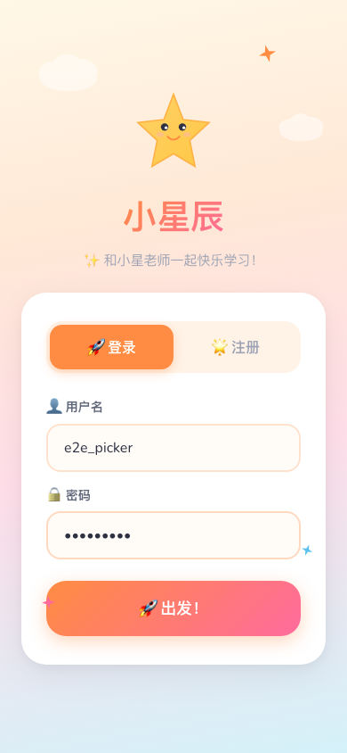
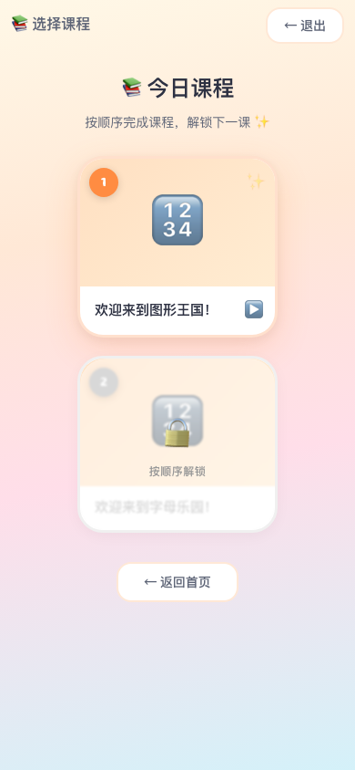

# Lesson Picker E2E 测试报告

**时间**: 2026/4/10 19:48:41
**用户**: testuser_e2e (child: 小明, child_id=3)
**缓存课程**: math-shapes, english-song-abc (2 节)

## 测试结果

| 状态 | 测试项 | 详情 |
|------|--------|------|
| ✅ PASS | 登录成功 | 到达首页 |
| ✅ PASS | 首页开始学习按钮 | 按钮可见 |
| ✅ PASS | 学习页面加载 | data-testid="learning-session" 存在 |
| ✅ PASS | 科目选择页 | 显示"选择要学习的科目" |
| ✅ PASS | 【核心】课程选择器展示 | 标题显示"选择课程"，未直接进入课堂 |
| ✅ PASS | 课程列表标题 | "今日课程"文字显示 |
| ✅ PASS | 顺序提示 | "按顺序完成课程，解锁下一课"文字显示 |
| ✅ PASS | 可学习状态指示 | 2 个 ✨ 闪烁指示 |
| ✅ PASS | 锁定状态 | 1 个 🔒，1 个"按顺序解锁" |
| ✅ PASS | C2: lesson picker 安全退出 | 返回首页: http://localhost:5173/ |
| ✅ PASS | C2: 退出无状态错误 | 无 endSession/startSession 相关错误 |

## 统计
- 总计: 11
- ✅ PASS: 11
- ❌ FAIL: 0
- ⚠️ SKIP: 0

## 截图

### 00-quick-test.png

### 01-login-page.png

### 02-login-filled.png

### 03-after-login.png

### 04-child-selected.png

### 05-home-ready.png

### 06-learning-session.png

### 07-math-selected.png

### 08-after-start.png

### 09-lesson-picker-view.png

### 10-unlock-state.png

### 11-after-exit.png
